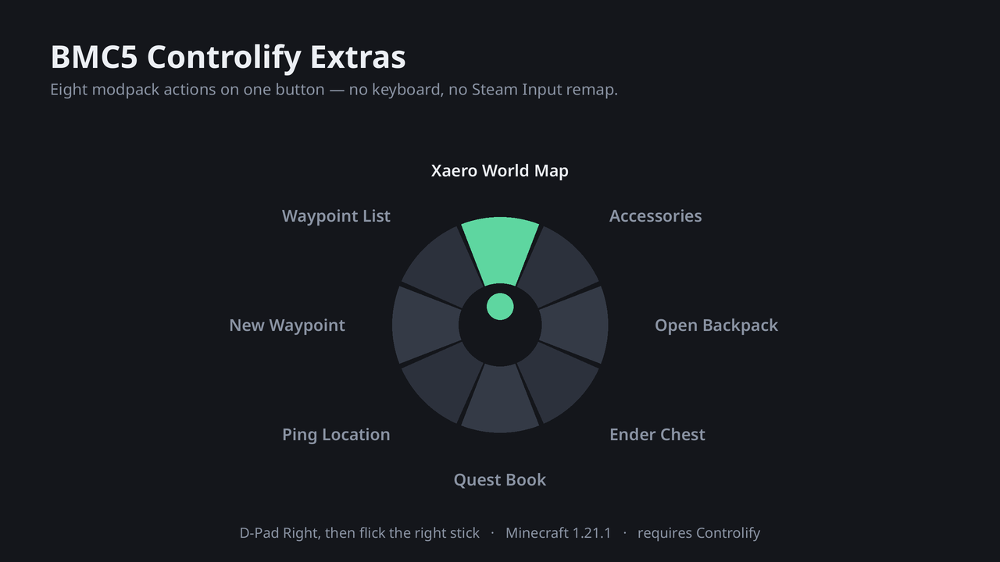
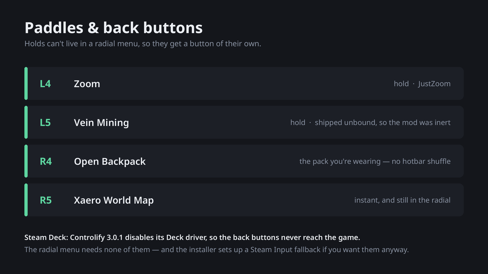

# BMC5 Controlify Extras

A drop-in resource pack (plus a small installer) that makes **Better MC 5
[NEOFORGE] v52** properly playable on a controller, without switching your
Steam controller profile to a keyboard-mapping layout.

Built and verified against the exact versions in the pack:
Minecraft **1.21.1**, NeoForge **21.1.234**, Controlify **3.0.1+lts**.



## What it fixes

| Problem | Fix |
| --- | --- |
| No buttons left for modpack actions | An 8-slot **radial menu** preloaded with the BMC5 essentials — map, waypoints, backpack, accessories, ender chest, ping |
| Extra/back buttons unbindable | **Paddle bindings** for controllers that expose them (8BitDo Ultimate 2, Xbox Elite, …) |
| Xaero's map & FTB Quests unusable with a stick | Those screens added to Controlify's **virtual mouse** list |
| Steam Deck back buttons do nothing | Explained + worked around — see [docs/STEAM-DECK.md](docs/STEAM-DECK.md) |

Nothing here is a Java mod. It's a resource pack, because Controlify reads its
default bindings and default profile out of the **resource pack stack** — so a
pack can ship binds for keybinds belonging to *other* mods. Details and the
decompiled evidence are in [docs/FINDINGS.md](docs/FINDINGS.md).

## Install

```sh
scripts/install.py "<instance folder>"             # desktop / 8BitDo
scripts/install.py "<instance folder>" --deck      # Steam Deck (see below)
scripts/install.py "<instance folder>" --dragons   # + Dragon Mounts add-on
```

Add `--dry-run` first if you want to see the changes without writing anything.
Point it at the instance folder or its inner `minecraft/` dir — either works.

Prism (Flatpak) instances live under:

```
~/.var/app/org.prismlauncher.PrismLauncher/data/PrismLauncher/instances/
```

The installer builds `dist/BMC5-Controlify-Extras.zip`, copies it into
`resourcepacks/`, enables it **last** in `options.txt` (so its Controlify
defaults win over every other pack), and adds the virtual-mouse screen classes
to `config/controlify.json`. Every file it edits is backed up alongside the
original as `*.bak-<timestamp>`.

**Close Minecraft first.** Controlify rewrites `controlify.json` when the game
exits, so edits made while it's running are lost.

### Copying the zip in by hand isn't enough

Two things the zip alone can't do:

1. **Enable it.** A pack sitting in `resourcepacks/` is inert until you switch
   it on in **Options → Resource Packs**.
2. **Change a radial menu you've already got.** Controlify only reads
   `default_config` from `ProfileSettings.createDefault()` — it seeds a profile
   for a controller it has never seen. Once a profile exists in `profiles[]` in
   `controlify.json`, it keeps its stored `input.radial_menu.actions` forever.
   So on any instance you've already played, the radial stays stock.

The installer handles both, rewriting `input.radial_menu.actions` in every saved
profile (`--keep-radial` opts out). By hand, set the eight slots yourself via
**Controlify settings → your controller → Radial Menu → CONFIGURE**.

**Paddle bindings are not affected** by this — a bind equal to its default is
dropped from the saved config, so the pack's binds resolve from the defaults at
load time and do apply to an existing profile.

### "There's no Resource Packs button"

Not BMC5 hiding it on purpose — an accident, and it only happens on some
installs.

FancyMenu identifies vanilla buttons by **screen position**: in
`options_screen_layout.txt` every `instance_identifier` is literally
`(x + 73) || y`. BMC5's layout hides whatever sits at one particular spot
(`x=273, y=187`, the bottom-left of the options grid).

Any mod that adds a row to the Options screen shifts everything below it down
24px, and that stored position then points at a *different* button. **Physics
Mod** does exactly this — it injects a full-width "Physics Settings…" row via
`MixinOptionsScreen`:

```
without Physics Mod          with Physics Mod
  y=91   skin|sounds           y=91   PHYSICS SETTINGS (full width)
  y=115  video|controls        y=115  skin|sounds
  y=139  language|chat         y=139  video|controls
  y=163  resourcepack|access   y=163  language|chat
  y=187  credits    <-- hidden y=187  resourcepack|access  <-- hidden
                               y=211  credits
```

So with Physics Mod installed the hide lands on **Resource Packs**; without it,
it lands on the harmless button BMC5 presumably meant. That's why the same pack
shows the button on one machine and not another — it depends on which mods you
added, not on the pack version.

The installer flips that single `is_hidden` to `false` (`--keep-menu` opts out),
which simply stops the layout hiding anything. By hand, edit
`config/fancymenu/customization/options_screen_layout.txt` and keep the file's
CRLF line endings — a plain `sed 's/is_hidden = true$//'` matches nothing,
because `$` sits behind the `\r`.

That file is a pack override, so **an update re-hides it**; re-run the installer
afterwards.

(Telemetry Data is missing for an unrelated reason: the game doesn't add that
button here at all, which is why the grid is five rows rather than six.)

### No terminal? Do all of it in-game

Nothing here actually requires the installer — handy on a Steam Deck in Gaming
Mode, where dropping to a shell means leaving the session.

1. **Enable the pack.** In-game **Options → Resource Packs** (un-hide the
   button first — see above), move
   *BMC5 Controlify Extras* to the selected side, **Done**. (A launcher's
   resource-pack tab only lists the folder; it does not enable anything.)
2. **Set the radial.** **Controlify settings → your controller → Radial Menu →
   CONFIGURE**, then pick the eight slots. Tedious once, permanent after.
3. **Turn on the virtual mouse where you need it.** Open Xaero's map, or the
   FTB quest book, and press the **virtual-mouse toggle** — `vmouse_toggle`,
   which defaults to the **Back / View** button (⧉ on a Deck). You'll get a
   *"Virtual mouse is now enabled for this screen"* toast, and it is **saved**:
   the handler adds the screen's class to `virtual_mouse_screens` and calls
   `ConfigManager.saveSafely()`. Do it once per screen and it sticks.

   The same button changes perspective during play — that's not a clash. The two
   bindings carry different `BindContext`s, so the in-game one fires in the
   world and the toggle fires on a screen.

The installer just does these three things for you, plus the Steam Input
keybinds under `--deck`.

## The radial menu

Press **D-Pad Right** (Controlify's default) and flick the **right stick**:

```
                     ↑   Xaero World Map
   Waypoint List ↖         ↗   Accessories Screen
    New Waypoint ←    ( ● )    →  Open Backpack
           Ping  ↙         ↘   Ender Chest
                     ↓   Quest Book
```

The four most-used actions sit on the cardinal directions, which are far easier
to hit than the diagonals. **Open Backpack** is the Backpacked keybind, so it
opens the pack you're *wearing* — no unequipping, no hotbar shuffle.

**Quest Book** is FTB Quests' `Open Quests`, which ships **unbound** in BMC5 —
so in a quest-driven pack the quest log had no key at all, on controller *or*
keyboard. Its screen is an `ftblibrary.ui.BaseScreen`, which the installer
already adds to the virtual-mouse list, so it's navigable once opened.

## Paddles



If your controller exposes paddles, these are bound automatically:

| Paddle | Action |
| --- | --- |
| L4 (`left_paddle_1`) | Zoom — hold (JustZoom) |
| L5 (`left_paddle_2`) | Vein mining — hold |
| R4 (`right_paddle_1`) | Open backpack |
| R5 (`right_paddle_2`) | Open world map |

Zoom and vein mining are *holds*, which a radial menu can't do — that's why
they live on paddles. Map and backpack are on paddles **as well as** in the
radial, because they're frequent enough to deserve an instant button.

**Vein Mining was inert before this.** Its config sets
`activationState = "HOLD_KEY_DOWN"` while the keybind shipped unbound, so the
mod could not be triggered at all — the mod's own warning string is *"Vein
mining key is unbound, set a key binding to enable controls."* Binding a paddle
fixes it. On a pad with no paddles, bind it in Controlify by hand or give it a
key in Options → Controls; the radial can't host it because it's a hold.

**8BitDo Ultimate 2 Wireless:** SDL only ships paddle mappings for this pad on
Windows/macOS — there is no Linux entry in Controlify's bundled database, only
for the *Ultimate 2C*. On Linux the paddles may arrive as raw numbered buttons
instead. If they don't respond, open Controlify's bind screen and press one; if
it shows up as `Button #17` or similar, bind it there by hand. Also make sure
the paddles aren't set to *duplicate* a face button in 8BitDo's Ultimate
Software — set them to their own dedicated outputs, or SDL sees the face button.

**Steam Deck:** the back buttons cannot reach Controlify at all in 3.0.1.
See [docs/STEAM-DECK.md](docs/STEAM-DECK.md) for why, and for the Steam Input
workaround that `--deck` sets up.

## Optional: Dragon Mounts add-on

Dragon Mounts Remastered ships `Descend`, `Dismount` and `Dragon Command Menu`
unbound, and there are no buttons left. The add-on pack exploits the fact that
**two Controlify bindings may share one input** — the config screen only paints
sharers red, it never blocks them, and at runtime both fire.

That only *helps* when the two actions can't both be live. `Call Dragon` works
when you're on foot; `Descend` works when you're flying one. They're mutually
exclusive in the mod's own logic, so they can share a paddle safely:

| Input | On foot | While riding |
| --- | --- | --- |
| R5 (`right_paddle_2`) | Call Dragon | Descend |

It frees R5 by unbinding the world map there (`"type": "empty"`) — the map is
still radial slot 0, so nothing is actually lost. Install with `--dragons`; it
loads *after* the main pack, so its overrides win.

**Don't pair `Descend` with jump.** Jump is ascend while mounted, so they'd
fight each other — the pairing has to be foot-state against flight-state, not
two flight actions. `Dismount` needs no binding at all: vanilla sneak already
dismounts.

## Customising

Everything is editable in-game: **Controlify settings → your controller →
Radial Menu → CONFIGURE**, and the bind list right below it. Any bind you
change by hand is saved to your profile and from then on overrides this pack.

To change the defaults instead, edit
`pack/assets/controlify/controllers/default_config/default.json` (radial slots,
in clockwise order from the top) or `default_bind/default.json` (paddles), then
re-run the installer.

Binding IDs for other mods follow a fixed rule — Controlify registers every
modded keybind as:

```
fabric-key-binding-api-v1:<the keybind's translation key>
```

So `gui.xaero_open_map` becomes
`fabric-key-binding-api-v1:gui.xaero_open_map`. Translation keys are the
`key_*` entries in the instance's `options.txt`. (The `fabric-` namespace is
not a typo — Controlify uses it on NeoForge too.)

## Modrinth

Both packs are built into `dist/` ready to upload. See
[docs/MODRINTH.md](docs/MODRINTH.md) for the project settings, listing copy and
the publish script.

On a modpack without these mods nothing breaks: a radial slot naming a missing
binding logs a warning and renders empty, and a default bind for an
unregistered keybind is never looked up.

## Uninstall

Disable the pack in **Options → Resource Packs**, or delete
`resourcepacks/BMC5-Controlify-Extras.zip`. To revert the config edits, restore
the `.bak-<timestamp>` files the installer left next to `options.txt` and
`config/controlify.json`.
